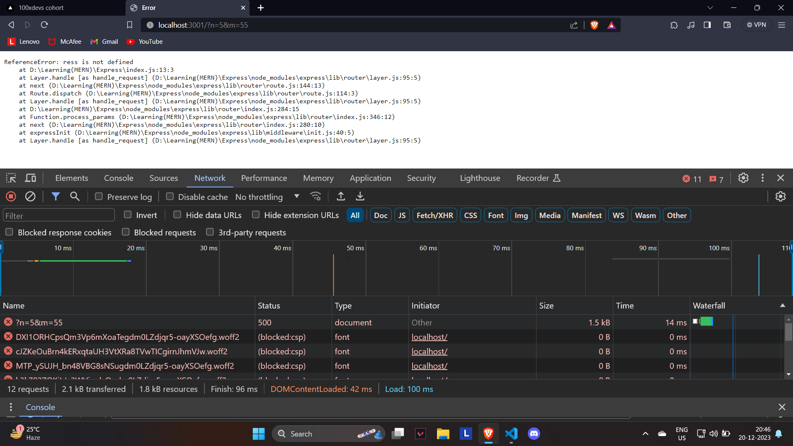
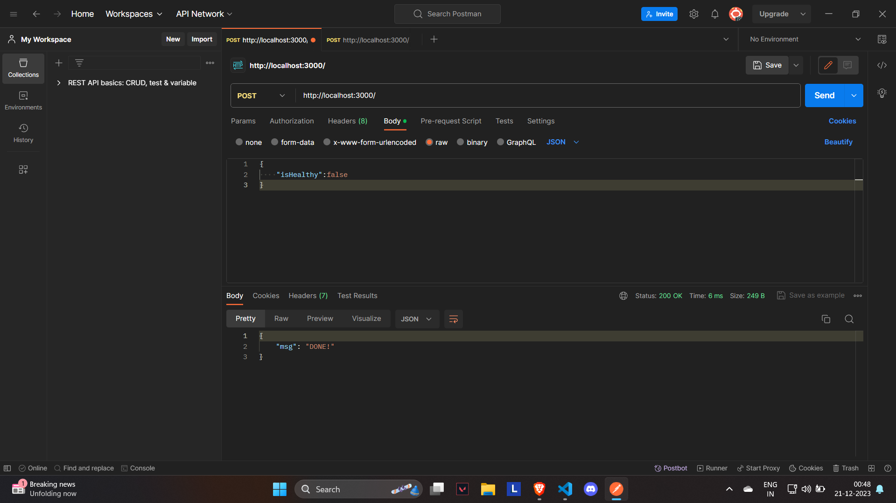

# Learning Express

> Javascript is a Single Threaded it can handle only one request at a time

## HTTP Servers Using **_EXPRESS_**

HTTP - Hyper Text Transfer Protocol

We can expose the code logic into the world ( Deploying out of our machine ) by Creating `HTTP Server` so anyone can make use of that logic , we can Create HTTP Servers using **_`Express`_**

## Creating a HTTP Server

1. Import the express library it is like fs ( filesystem ) library but it doesn't comes with the Node bundle `NPM` so we need to bring it inside our machine use : `npm install express`, express is a HTTP Server which is built by Developers we are not creating a new HTTP Server we can use the prebuilt http server by using some funtions

```js
const express = require("express");
```

2. Creating a Instance ( like we did using CLASSES )called app so that we can use the various functionalities ( just for the sake of syntax & and Easier the understand )

```js
const app = express();
```

3. using functionality `.get`

```js
app.get("/route123", function (req, res) {
  const n = req.query.n;
  const ans = calculateSum(n);
  res.send(ans);
});
```

### Code Explaination

`.get` method has two parameters 1.Route 2.Callback Function , if anyone come inside the `/route123` route then it will calls the callback function and it has two arguments 1.request 2.response

`req.query.n` -> getting input from the user by **Query Parameter** way and calling a function with the input that we got and `res.send(ans)` will sent the response to the user

4. using a Port

```js
app.listen(3000);
```

it will listen to the port Number of 3000 if anyone uses this port along with the route can only able use the code

> TIP : ctrl + C To Stop the Node Server

## Passing Input

there are two ways of Passing Input , if Nothing is passed then `NAN` will be printed

1. Query Parameter
2. using Body (information inside POST)

## 1.Query Params

```url
localhost:3000/route/?n=5&m=10
```

here Everything after `?` will be consider as query parameter with a var name eg : `n=10` and to add multiple parameters use `&` operator followed by the next parameter eg:`?n=10 & m=10`

**NOTE : the query parameter must be the same as decalred eg : `n=10` is valid ✅ but `a=10` is not valid ❌**

## Getting the Input

by using `res.query` we can get those Inputs

```js
const val1 = res.query.n;
```

here n is a parameter value and it should be same as the input uses by the user

## Request Method

Whenever we are calling the http we should pass a request eg : `app.get()`

1. `GET` - Asking the Server to Get something eg.calculating the result of two numbers
2. `POST` - Post Some Data into the Server eg.Creating a Instagram Post
3. `PUT` - Update Data on a Server
4. `DELETE` - Deleting Data on the Server

## Status Codes

what server responds to the Client and Client identifies that something did by the server and gives the response code

1. 200 - Fine/OK
2. 404 - route is not found
3. 500 - something went wrong / Exception
4. 411 - user has inputed wrong values
5. 403 - restrict the client



## json

we can respond the data into json format by converting them into json

```js
res.json({
  val,
  val2,
});
```

## POST

we can add data into database/server

we can post INPUT using `body` method

```js
const isHealthy = req.body.isHealthy;
//updating the inMemory (global variable inside Program)
user[0].kidneys.push({
  health : false;
})
```

### Send a post request using **_POSTMAN_**

POSTMAN is a Simulation tools used for post , put, delete , get requests so that it can tweek arguments

here the data will be passed using the body so we need to parse the body using the `app.use(express.json())` it will parse the json data which has passed using the body method

[Detailed overview from GeekforGeeks Checkit later](https://www.geeksforgeeks.org/introduction-postman-api-development/)

````js
  const isHealthy = req.body.isHealthy;
  users[0].kidneys.push({
    health: isHealthy,
  });
  res.json({
    msg: "DONE!",
  });```
````

### Program Explaination

here we are catching the `.isHealthy` and at POSTMAN we should pass that JSON and then it will give the value of `isHealthy` property -> `isHealthy : true|false` and it will modify the local variable and `.get` will be executed , here we are using `res.json()` which is a response msg that indicates post request is succesfully done



## 3.PUT & 4.DELETE

> we use POSTMAN for sent put/delete request it doesn't meant to have a body

it doesnt have to use `request` argument because it will modify or delete the data present in the server it will only user the `response` to indicate that put/delete request method has completed

eg code for put :

```js
users[0].kidneys.map((kidney) => (kidney.health = true));
res.json({
  msg: "content modified",
});
```

## Using Status Code

it is a Best Practice to use status code cuz the front-end identifies the backend operation using status code and it will deliver the content using the status code

```js
res.status(411);
```
